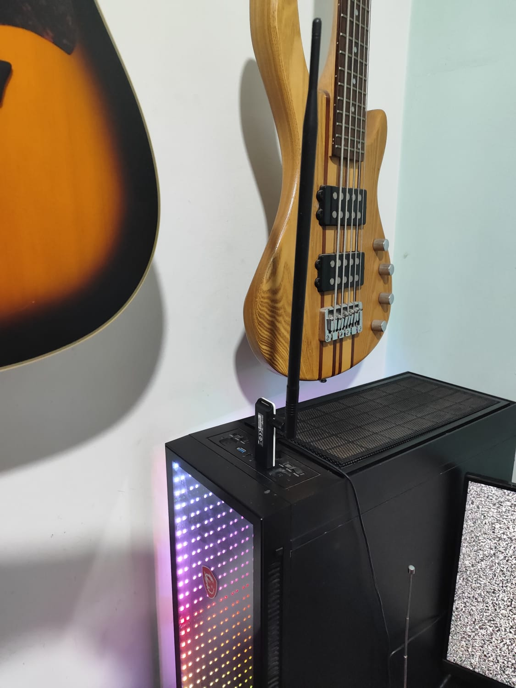
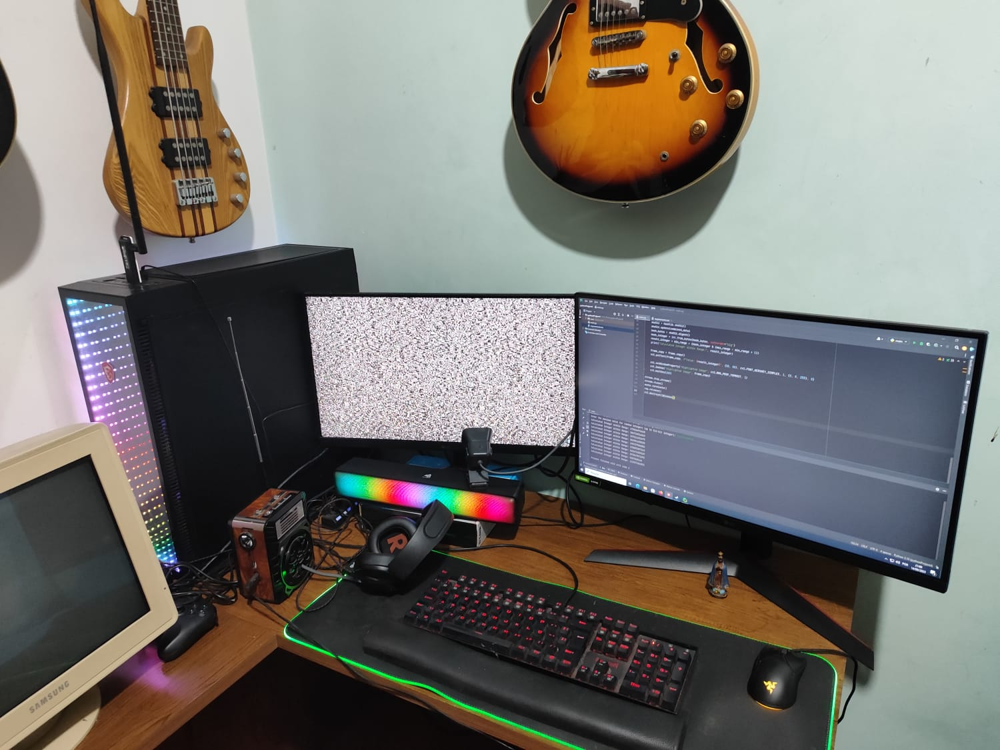

# eXtremeEntropyRandomGenerator


## Overview


eXtremeEntropyRandomGenerator is a cutting-edge project that pushes the boundaries of randomness and entropy in data generation using Python. This project aims to create secure, unpredictable random numbers by combining audio data from radio static noise and visual data from CRT static noise, enhancing entropy, and providing novel applications in various fields.

## Table of Contents

- [Background](#background)
- [Installation](#installation)
- [Usage](#usage)
- [Entropy and Random Numbers](#entropy-and-random-numbers)
- [Audio and Visual Fusion](#audio-and-visual-fusion)
- [Saving Audio](#saving-audio)
- [Cleanup](#cleanup)
- [License](#license)

## Background

In the world of data and technology, the pursuit of true randomness is a fascinating endeavor. eXtremeEntropyRandomGenerator was conceived as an exploration into the generation of secure random numbers with a focus on maximizing entropy. This project leverages Python libraries, including PyAudio and OpenCV, to capture audio data from radio static noise and visual data from CRT static noise, merging them with random bytes and timestamps, and generating unpredictable 512-bit hashes.

## Installation

To run this project, you need to have Python installed on your system. Follow these steps to set up the environment:

1. Clone this repository to your local machine:

   ```bash
   git clone https://github.com/victormeloasm/eXtremeEntropyRandomGenerator.git
   ```

2. Navigate to the project directory:

   ```bash
   cd eXtremeEntropyRandomGenerator
   ```

3. Install the required dependencies:

   ```bash
   pip install -r requirements.txt
   ```

## Usage


[Watch the Video](https://www.youtube.com/watch?v=17MMJY9gkv4)


### Generating Random Numbers

1. Run the `eXtremeEntropyRandomGenerator.py` script to start the random number generation process or unzip the /dist/eXtremeEntropyRandomGenerator.exe with winRAR or 7zip.

2. You will be prompted to enter the range for random numbers. This input defines the upper bound for the random integers you want to generate It's from 0 to a 64 bytes integer.

3. The program will capture 1-second segments of audio from radio static noise and random frames from CRT static noise. It will also generate random bytes and timestamps to increase entropy.

4. The generated data will be combined and hashed using the SHA-512 algorithm, resulting in a 512-bit hash. This hash is then converted to an integer.

5. The generated integers within the specified range will be printed in the terminal.

### Entropy and Random Numbers

The project maximizes entropy by combining multiple sources of randomness:

- **Audio Data from Radio Static Noise:** Captured from the radio waves, this source provides audio-based entropy.
- **Visual Data from CRT Static Noise:** Captured from the CRT screen, this source offers visual-based entropy.
- **Random Bytes:** Generated using Python's `os.urandom`.
- **Timestamps:** Current Unix timestamps provide a temporal source of entropy.

The combination of these diverse sources ensures that the generated random numbers are highly unpredictable and secure.

### Audio and Visual Fusion

One of the unique aspects of this project is the fusion of audio and visual data from radio static noise and CRT static noise, respectively. By merging audio segments and random frames, we create a new form of multi-sensory data, enhancing the randomness of the final output. This concept has applications in cryptography, security, and data encryption.

### Saving Audio

To preserve the original audio segments for further analysis, the program saves them as WAV files in the current directory. The filenames correspond to each iteration of the experiment (e.g., `audio_0.wav`, `audio_1.wav`).

### Cleanup

Upon completion, the program cleans up the generated data from memory, ensuring that no sensitive information remains in the system's memory.

## License

This project is licensed under the MIT License. See the [LICENSE](LICENSE) file for details.

 This program was conceived and crafted by Víctor Duarte Melo on 14/09/2023 - Brazil. If you intend to use or modify it, please provide proper credits. 
 Building the structure and coding this project wasn't an easy task; it involved countless hours of testing and an entire night of planning. Please use it responsibly.
 Contact: victormeloasm@gmail.com

eXtremeEntropyRandomGenerator represents an exciting exploration into the world of randomness, entropy, and data fusion. It underscores the significance of entropy in data generation, highlighting its relevance in securing sensitive information. The fusion of audio and visual data from radio static noise and CRT static noise introduces new possibilities for data fusion and multi-sensory applications. This project serves as a captivating experiment in randomness, reminding us that randomness is not just a mathematical concept; it's a valuable resource with real-world applications in data security and beyond.

Enjoy experimenting with eXtremeEntropyRandomGenerator and exploring the boundless possibilities of randomness!


Everything was made by Víctor Duarte Melo, contact: victormeloasm@gmail.com

Certainly, here's an explanation of how the addition of entropy using Wi-Fi noise enhances randomness in a computational context:

**Enhancing Entropy with Wi-Fi Noise: Boosting Randomness in Computing**




Entropy, in the context of computing and cryptography, is a measure of randomness or uncertainty. In cryptographic applications, high entropy is vital for ensuring the security and unpredictability of keys, passwords, and random values generated by software. To increase entropy, developers often seek external sources of randomness to add to their computational processes, and one unconventional but intriguing source is the noise from Wi-Fi networks.

**What Is Wi-Fi Noise?**

Wi-Fi noise refers to the random electromagnetic signals that are present in the radio frequency spectrum utilized by wireless networks. These signals are generated by a multitude of factors, including interference from other electronic devices, environmental conditions, and the inherent unpredictability of wireless communications. These factors create a unique and continuously changing electromagnetic environment.

**Adding Wi-Fi Noise to Enhance Entropy**

To enhance the entropy of random number generation or cryptographic operations, developers capture Wi-Fi noise and incorporate it into their computations. The process typically involves measuring the noise level or signal strength of nearby Wi-Fi networks. The resulting value, often expressed as a numeric or bit sequence, is then used to augment the randomness of a computational task.

**Advantages of Adding Wi-Fi Noise:**

1. **Increased Entropy**: Wi-Fi noise is inherently unpredictable and dynamic, making it an excellent source of entropy. When combined with other sources of randomness, such as sensor data or user input, it significantly boosts the unpredictability of generated values.

2. **Security**: Applications requiring high levels of security, such as cryptographic key generation or password hashing, can benefit from the additional randomness provided by Wi-Fi noise. This makes it more challenging for adversaries to predict or guess generated values.

3. **Diverse Sources**: By integrating Wi-Fi noise, developers can tap into a diverse source of entropy, reducing the reliance on a single, potentially limited source of randomness.

**Considerations and Challenges:**

1. **Availability**: Capturing Wi-Fi noise depends on the presence of Wi-Fi networks in the vicinity. In areas with no Wi-Fi signals, this source of entropy may not be available.

2. **Variability**: Wi-Fi noise can vary over time due to changes in network usage and interference. Developers must account for this variability in their applications.

3. **Hardware Requirements**: To capture Wi-Fi noise, specific hardware and software libraries may be required. Additionally, access to Wi-Fi interfaces and permissions may be necessary.

In summary, incorporating Wi-Fi noise into computational processes is a creative way to augment entropy, making random number generation and cryptographic operations more robust and secure. While it may not be the sole source of randomness, it adds an extra layer of unpredictability, strengthening the overall security and reliability of computational systems. Developers should carefully consider the availability and variability of Wi-Fi noise in their specific use cases and balance it with other sources of entropy to achieve the desired level of randomness and security.


DIEHARDER REPORT ALL TESTS:

#=============================================================================#
#            dieharder version 3.31.1 Copyright 2003 Robert G. Brown          #
#=============================================================================#
   rng_name    |           filename             |rands/second|
        mt19937|                    randomic.txt|  1.04e+08  |
#=============================================================================#
        test_name   |ntup| tsamples |psamples|  p-value |Assessment
#=============================================================================#
   diehard_birthdays|   0|       100|     100|0.72433123|  PASSED  
      diehard_operm5|   0|   1000000|     100|0.27238466|  PASSED  
  diehard_rank_32x32|   0|     40000|     100|0.76509078|  PASSED  
    diehard_rank_6x8|   0|    100000|     100|0.35591599|  PASSED  
   diehard_bitstream|   0|   2097152|     100|0.35445425|  PASSED  
        diehard_opso|   0|   2097152|     100|0.72568598|  PASSED  
        diehard_oqso|   0|   2097152|     100|0.70928316|  PASSED  
         diehard_dna|   0|   2097152|     100|0.45749617|  PASSED  
diehard_count_1s_str|   0|    256000|     100|0.80784910|  PASSED  
diehard_count_1s_byt|   0|    256000|     100|0.68515766|  PASSED  
 diehard_parking_lot|   0|     12000|     100|0.56023159|  PASSED  
    diehard_2dsphere|   2|      8000|     100|0.63483247|  PASSED  
    diehard_3dsphere|   3|      4000|     100|0.14338160|  PASSED  
     diehard_squeeze|   0|    100000|     100|0.98270118|  PASSED  
        diehard_sums|   0|       100|     100|0.08500998|  PASSED  
        diehard_runs|   0|    100000|     100|0.67179656|  PASSED  
        diehard_runs|   0|    100000|     100|0.81240496|  PASSED  
       diehard_craps|   0|    200000|     100|0.21289668|  PASSED  
       diehard_craps|   0|    200000|     100|0.93589066|  PASSED  
 marsaglia_tsang_gcd|   0|  10000000|     100|0.70418385|  PASSED  
 marsaglia_tsang_gcd|   0|  10000000|     100|0.63820254|  PASSED  
         sts_monobit|   1|    100000|     100|0.35039047|  PASSED  
            sts_runs|   2|    100000|     100|0.77003048|  PASSED  
          sts_serial|   1|    100000|     100|0.43163495|  PASSED  
          sts_serial|   2|    100000|     100|0.41147942|  PASSED  
          sts_serial|   3|    100000|     100|0.33776536|  PASSED  
          sts_serial|   3|    100000|     100|0.52387729|  PASSED  
          sts_serial|   4|    100000|     100|0.21771600|  PASSED  
          sts_serial|   4|    100000|     100|0.26921488|  PASSED  
          sts_serial|   5|    100000|     100|0.36659272|  PASSED  
          sts_serial|   5|    100000|     100|0.98134781|  PASSED  
          sts_serial|   6|    100000|     100|0.90645412|  PASSED  
          sts_serial|   6|    100000|     100|0.10260654|  PASSED  
          sts_serial|   7|    100000|     100|0.73155652|  PASSED  
          sts_serial|   7|    100000|     100|0.99992902|  PASSED  
          sts_serial|   8|    100000|     100|0.08123710|  PASSED  
          sts_serial|   8|    100000|     100|0.43145232|  PASSED  
          sts_serial|   9|    100000|     100|0.98615916|  PASSED  
          sts_serial|   9|    100000|     100|0.96007331|  PASSED  
          sts_serial|  10|    100000|     100|0.77093105|  PASSED  
          sts_serial|  10|    100000|     100|0.82039646|  PASSED  
          sts_serial|  11|    100000|     100|0.29109440|  PASSED  
          sts_serial|  11|    100000|     100|0.74367310|  PASSED  
          sts_serial|  12|    100000|     100|0.02372162|  PASSED  
          sts_serial|  12|    100000|     100|0.48275721|  PASSED  
          sts_serial|  13|    100000|     100|0.79426992|  PASSED  
          sts_serial|  13|    100000|     100|0.54331210|  PASSED  
          sts_serial|  14|    100000|     100|0.11804215|  PASSED  
          sts_serial|  14|    100000|     100|0.13204931|  PASSED  
          sts_serial|  15|    100000|     100|0.85165891|  PASSED  
          sts_serial|  15|    100000|     100|0.22080209|  PASSED  
          sts_serial|  16|    100000|     100|0.82895465|  PASSED  
          sts_serial|  16|    100000|     100|0.59050654|  PASSED  
         rgb_bitdist|   1|    100000|     100|0.43664362|  PASSED  
         rgb_bitdist|   2|    100000|     100|0.20844529|  PASSED  
         rgb_bitdist|   3|    100000|     100|0.58354655|  PASSED  
         rgb_bitdist|   4|    100000|     100|0.80446566|  PASSED  
         rgb_bitdist|   5|    100000|     100|0.61005853|  PASSED  
         rgb_bitdist|   6|    100000|     100|0.98573858|  PASSED  
         rgb_bitdist|   7|    100000|     100|0.92472115|  PASSED  
         rgb_bitdist|   8|    100000|     100|0.30833980|  PASSED  
         rgb_bitdist|   9|    100000|     100|0.45026130|  PASSED  
         rgb_bitdist|  10|    100000|     100|0.43083304|  PASSED  
         rgb_bitdist|  11|    100000|     100|0.55034872|  PASSED  
         rgb_bitdist|  12|    100000|     100|0.99613084|   WEAK   
rgb_minimum_distance|   2|     10000|    1000|0.46703797|  PASSED  
rgb_minimum_distance|   3|     10000|    1000|0.09803903|  PASSED  
rgb_minimum_distance|   4|     10000|    1000|0.91388384|  PASSED  
rgb_minimum_distance|   5|     10000|    1000|0.02420297|  PASSED  
    rgb_permutations|   2|    100000|     100|0.02379137|  PASSED  
    rgb_permutations|   3|    100000|     100|0.16282711|  PASSED  
    rgb_permutations|   4|    100000|     100|0.92704181|  PASSED  
    rgb_permutations|   5|    100000|     100|0.15062927|  PASSED  
      rgb_lagged_sum|   0|   1000000|     100|0.08140658|  PASSED  
      rgb_lagged_sum|   1|   1000000|     100|0.70922490|  PASSED  
      rgb_lagged_sum|   2|   1000000|     100|0.97358110|  PASSED  
      rgb_lagged_sum|   3|   1000000|     100|0.94739842|  PASSED  
      rgb_lagged_sum|   4|   1000000|     100|0.23690997|  PASSED  
      rgb_lagged_sum|   5|   1000000|     100|0.45877016|  PASSED  
      rgb_lagged_sum|   6|   1000000|     100|0.82677569|  PASSED  
      rgb_lagged_sum|   7|   1000000|     100|0.25969978|  PASSED  
      rgb_lagged_sum|   8|   1000000|     100|0.24101698|  PASSED  
      rgb_lagged_sum|   9|   1000000|     100|0.16882803|  PASSED  
      rgb_lagged_sum|  10|   1000000|     100|0.98899244|  PASSED  
      rgb_lagged_sum|  11|   1000000|     100|0.52496438|  PASSED  
      rgb_lagged_sum|  12|   1000000|     100|0.99027968|  PASSED  
      rgb_lagged_sum|  13|   1000000|     100|0.37740509|  PASSED  
      rgb_lagged_sum|  14|   1000000|     100|0.18063973|  PASSED  
      rgb_lagged_sum|  15|   1000000|     100|0.91143227|  PASSED  
      rgb_lagged_sum|  16|   1000000|     100|0.17768946|  PASSED  
      rgb_lagged_sum|  17|   1000000|     100|0.72836372|  PASSED  
      rgb_lagged_sum|  18|   1000000|     100|0.37041005|  PASSED  
      rgb_lagged_sum|  19|   1000000|     100|0.80933614|  PASSED  
      rgb_lagged_sum|  20|   1000000|     100|0.15696774|  PASSED  
      rgb_lagged_sum|  21|   1000000|     100|0.02521283|  PASSED  
      rgb_lagged_sum|  22|   1000000|     100|0.31202371|  PASSED  
      rgb_lagged_sum|  23|   1000000|     100|0.69601123|  PASSED  
      rgb_lagged_sum|  24|   1000000|     100|0.19691309|  PASSED  
      rgb_lagged_sum|  25|   1000000|     100|0.65765982|  PASSED  
      rgb_lagged_sum|  26|   1000000|     100|0.48206419|  PASSED  
      rgb_lagged_sum|  27|   1000000|     100|0.21625791|  PASSED  
      rgb_lagged_sum|  28|   1000000|     100|0.22598654|  PASSED  
      rgb_lagged_sum|  29|   1000000|     100|0.75256039|  PASSED  
      rgb_lagged_sum|  30|   1000000|     100|0.96618094|  PASSED  
      rgb_lagged_sum|  31|   1000000|     100|0.97496706|  PASSED  
      rgb_lagged_sum|  32|   1000000|     100|0.33901137|  PASSED  
     rgb_kstest_test|   0|     10000|    1000|0.69251763|  PASSED  
     dab_bytedistrib|   0|  51200000|       1|0.53395811|  PASSED  
     dab_dct| 256|     50000|               1|0.24514002|  PASSED  
     dab_filltree|  32|  15000000|       1|0.95057910|  PASSED  
     dab_filltree|  32|  15000000|       1|0.96485369|  PASSED  
     dab_filltree2|   0|   5000000|       1|0.57150617|  PASSED  
     dab_filltree2|   1|   5000000|       1|0.33238137|  PASSED  
     dab_monobit2|  12|  65000000|       1|0.51849197|  PASSED  

