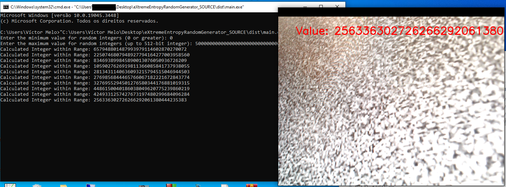

# eXtremeEntropyRandomGenerator


## Overview


eXtremeEntropyRandomGenerator is a cutting-edge project that pushes the boundaries of randomness and entropy in data generation using Python. This project aims to create secure, unpredictable random numbers by combining audio data from radio static noise and visual data from CRT static noise, enhancing entropy, and providing novel applications in various fields.

## Table of Contents

- [Background](#background)
- [Installation](#installation)
- [Usage](#usage)
- [Entropy and Random Numbers](#entropy-and-random-numbers)
- [Audio and Visual Fusion](#audio-and-visual-fusion)
- [Saving Audio](#saving-audio)
- [Cleanup](#cleanup)
- [License](#license)

## Background

In the world of data and technology, the pursuit of true randomness is a fascinating endeavor. eXtremeEntropyRandomGenerator was conceived as an exploration into the generation of secure random numbers with a focus on maximizing entropy. This project leverages Python libraries, including PyAudio and OpenCV, to capture audio data from radio static noise and visual data from CRT static noise, merging them with random bytes and timestamps, and generating unpredictable 512-bit hashes.

## Installation

To run this project, you need to have Python installed on your system. Follow these steps to set up the environment:

1. Clone this repository to your local machine:

   ```bash
   git clone https://github.com/victormeloasm/eXtremeEntropyRandomGenerator.git
   ```

2. Navigate to the project directory:

   ```bash
   cd eXtremeEntropyRandomGenerator
   ```

3. Install the required dependencies:

   ```bash
   pip install -r requirements.txt
   ```

## Usage





[Watch the Video](video_filename.mp4)


### Generating Random Numbers

1. Run the `eXtremeEntropyRandomGenerator.py` script to start the random number generation process or unzip the /dist/eXtremeEntropyRandomGenerator.exe with winRAR or 7zip.

2. You will be prompted to enter the range for random numbers. This input defines the upper bound for the random integers you want to generate It's from 0 to a 64 bytes integer.

3. The program will capture 1-second segments of audio from radio static noise and random frames from CRT static noise. It will also generate random bytes and timestamps to increase entropy.

4. The generated data will be combined and hashed using the SHA-512 algorithm, resulting in a 512-bit hash. This hash is then converted to an integer.

5. The generated integers within the specified range will be printed in the terminal.

### Entropy and Random Numbers

The project maximizes entropy by combining multiple sources of randomness:

- **Audio Data from Radio Static Noise:** Captured from the radio waves, this source provides audio-based entropy.
- **Visual Data from CRT Static Noise:** Captured from the CRT screen, this source offers visual-based entropy.
- **Random Bytes:** Generated using Python's `os.urandom`.
- **Timestamps:** Current Unix timestamps provide a temporal source of entropy.

The combination of these diverse sources ensures that the generated random numbers are highly unpredictable and secure.

### Audio and Visual Fusion

One of the unique aspects of this project is the fusion of audio and visual data from radio static noise and CRT static noise, respectively. By merging audio segments and random frames, we create a new form of multi-sensory data, enhancing the randomness of the final output. This concept has applications in cryptography, security, and data encryption.

### Saving Audio

To preserve the original audio segments for further analysis, the program saves them as WAV files in the current directory. The filenames correspond to each iteration of the experiment (e.g., `audio_0.wav`, `audio_1.wav`).

### Cleanup

Upon completion, the program cleans up the generated data from memory, ensuring that no sensitive information remains in the system's memory.

## License

This project is licensed under the MIT License. See the [LICENSE](LICENSE) file for details.

 This program was conceived and crafted by Víctor Duarte Melo on 14/09/2023 - Brazil. If you intend to use or modify it, please provide proper credits. 
 Building the structure and coding this project wasn't an easy task; it involved countless hours of testing and an entire night of planning. Please use it responsibly.
 Contact: victormeloasm@gmail.com

eXtremeEntropyRandomGenerator represents an exciting exploration into the world of randomness, entropy, and data fusion. It underscores the significance of entropy in data generation, highlighting its relevance in securing sensitive information. The fusion of audio and visual data from radio static noise and CRT static noise introduces new possibilities for data fusion and multi-sensory applications. This project serves as a captivating experiment in randomness, reminding us that randomness is not just a mathematical concept; it's a valuable resource with real-world applications in data security and beyond.

Enjoy experimenting with eXtremeEntropyRandomGenerator and exploring the boundless possibilities of randomness!


Everything was made by Víctor Duarte Melo, contact: victormeloasm@gmail.com
